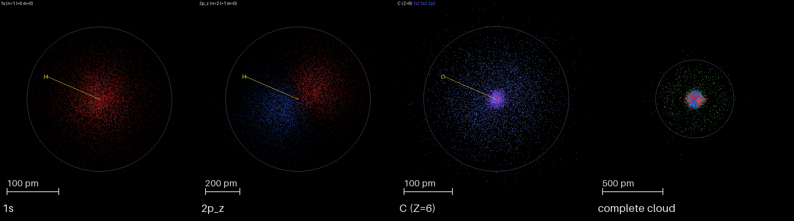
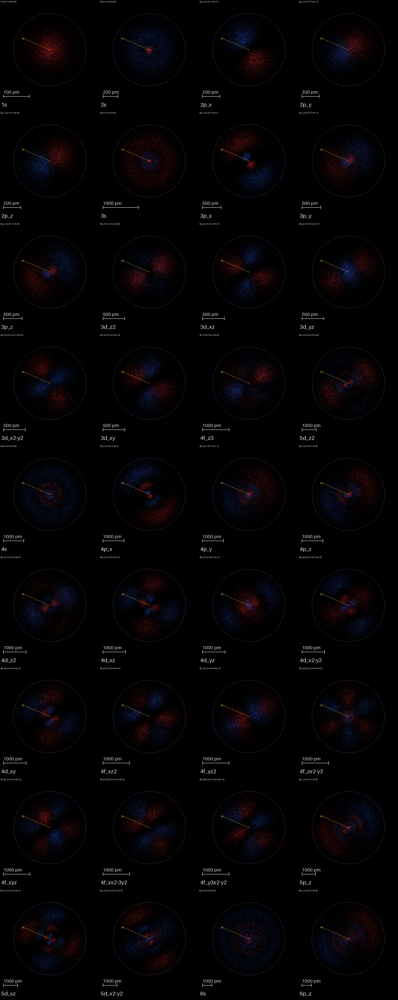
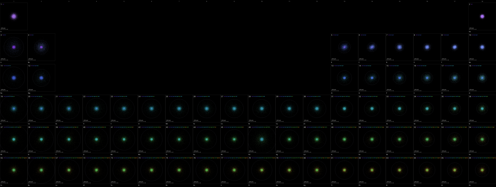
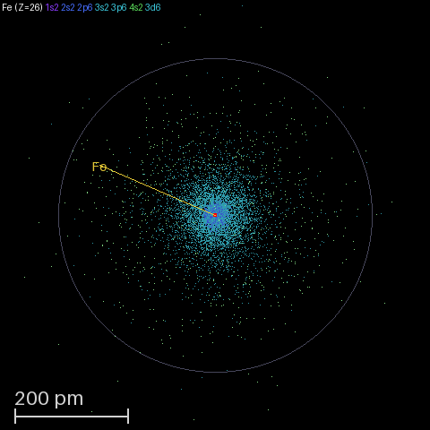
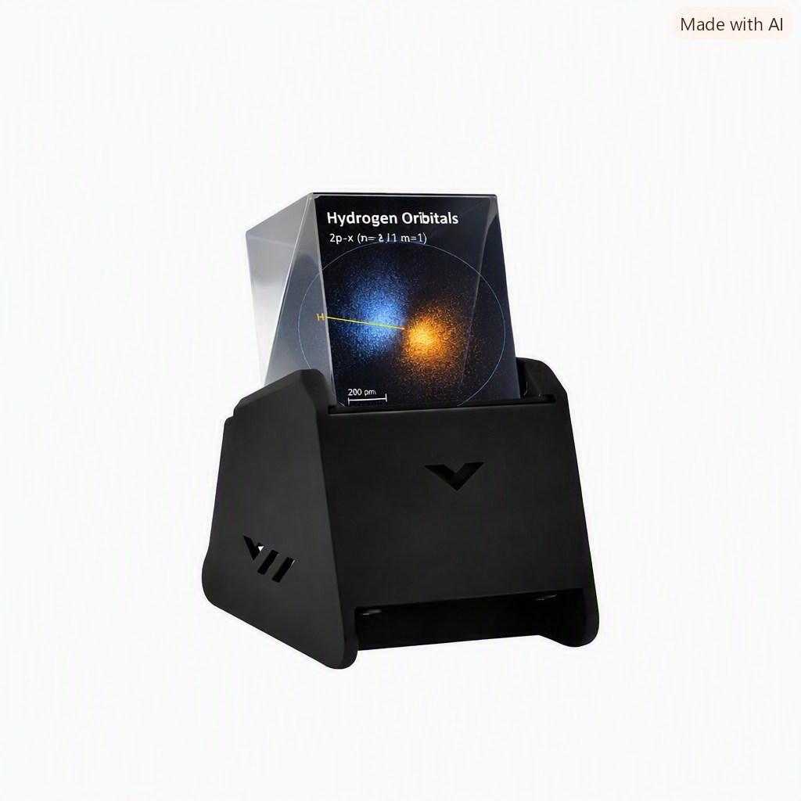
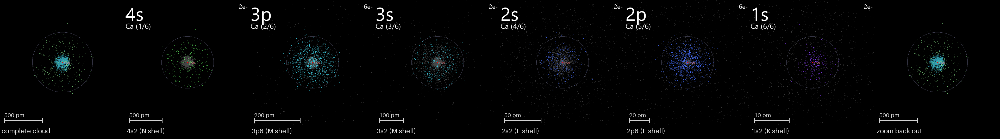

# Electron Hologram — quantum orbitals in a glass prism
# Ologramma dell'Elettrone — orbitali quantistici in un prisma di vetro

> A Pepper's Ghost hologram on a cheap ESP32 board: electron probability
> clouds — hydrogen orbitals and full multi-electron atoms — rendered as
> spinning point clouds and reflected off a glass prism so they float in
> mid-air above the screen.

> Un ologramma Pepper's Ghost su una scheda ESP32 economica: nuvole di
> probabilità elettronica — orbitali dell'idrogeno e atomi multielettronici
> completi — rese come nuvole di punti rotanti e riflesse da un prisma di
> vetro, così da fluttuare a mezz'aria sopra lo schermo.

**[Try it in your browser](https://fablab-bergamo.github.io/electron-3d-display/)** — no hardware needed, runs the same math as the device.
**[Provalo nel browser](https://fablab-bergamo.github.io/electron-3d-display/)** — nessun hardware richiesto, usa la stessa matematica del dispositivo.

[](LICENSE)
[](https://www.waveshare.com/wiki/ESP32-S3-LCD-1.3)
[](https://fablab-bergamo.github.io/electron-3d-display/)



**Read in / Leggi in:** [English](#english) · [Italiano](#italiano)

---

## English

### What is an electron, really?

An electron isn't a tiny ball orbiting the nucleus like a planet around
the sun — it doesn't have a fixed position until something measures it.
What quantum mechanics gives you instead is a probability distribution:
denser where the electron is more likely to turn up, thinner where it
isn't. The dumbbell and clover shapes chemists draw for orbitals are
exactly these distributions, plotted as |ψ|² (psi squared, the square of
the wavefunction).

This project turns those probability distributions into literal point
clouds — thousands of dots, each one a sampled possible position of the
electron — and spins them inside a glass prism so you can look at the
shape from any angle.

---

### What this project is

A [Pepper's Ghost](https://en.wikipedia.org/wiki/Pepper%27s_ghost)
hologram built on a **Waveshare ESP32-S3-LCD-1.3**: a 240×240 color
display inside a 4-face glass pyramid. The display shows the point cloud
upside-down on its back; the prism mirrors it into thin air above the
screen, and your eye sees a glowing 3D object hovering in space.

- **Hydrogen orbitals** (1s → 5d, 16 shapes) as tumbling point clouds,
  colored by the sign of psi_real with the same classic vibrant
  orange/blue pair across every preset (identical across PC, device, and
  web), with zoom breathing and a slow turnover of resampled points so the
  cloud stays alive instead of static.
- **Multi-electron atoms** (Z = 1–118, one click away) modeled as
  hydrogen-like subshells with effective nuclear charges (Slater /
  Clementi–Raimondi), colored by shell (K/L/M/N…).
- **Shell dissection** (PC simulator): peels the atom apart shell by
  shell, lighting up one subshell at a time while the rest dims.
- A **periodic-table gallery** rendered at a uniform physical scale, so
  relative atomic sizes are directly comparable.

### Gallery

All hydrogen orbitals, colored by wavefunction sign (orange lobe vs blue lobe):



The orbital showcase, animated (all 16 presets —
[`img/orbitals.gif`](img/orbitals.gif)):

Every element H→Xe on one canvas, same physical scale:



A whole atom in your hand (C and Fe, zoomed for detail):



The dissection sequence — zooming through iron's subshells, from the
diffuse 4s valence shell down to the 1s core:


All of these images are generated by the project itself —
`python3 pc/screenshot.py` renders them from the same math the device
runs.

---

### The hardware



*Illustrative concept render (AI-generated) of the assembled board and
prism showing a 2p orbital — not a photo of the actual hardware; see the
[gallery](#gallery) above for real output from the project.*

| Part | What it is |
|---|---|
| **Waveshare ESP32-S3-LCD-1.3** | ESP32-S3R8 (dual-core 240 MHz, 512 KB SRAM, 8 MB PSRAM, 16 MB flash), 1.3″ 240×240 ST7789V2 display on SPI, QMI8658 IMU (accelerometer + gyroscope), USB-C, TF-card slot
| **4-face prism cube** (the -C variant includes it) | The Pepper's Ghost mirror that makes the cloud float above the screen

The whole demo runs on the board alone: the IMU detects *nudges* (tilt the
board) to switch orbital or element — no buttons, no cables. See the
[Waveshare wiki](https://www.waveshare.com/wiki/ESP32-S3-LCD-1.3) for the
full board details.

> ⚠️ **Panel gotcha**: our physical unit's panel is horizontally mirrored
> and swaps R/B. `CLAUDE.md §2` documents the verified fixes (raw MADCTL
> write + BGR order). Re-run `examples/corner_calibration/` on your own
> unit before trusting the display — panels vary between batches.

---

### The math behind it

For hydrogen, the Schrödinger equation has exact solutions:

```text
ψ_nlm(r, θ, φ) = R_nl(r) · Y_l^m(θ, φ)
                 radial · angular
```

The point cloud is a Monte-Carlo sample of the probability density
|ψ|² · r² · sin(θ). That density **factorizes** into a product of
one-variable functions (r only × θ only × φ only), so each factor can be
sampled independently and the results combined without approximation. See
[Making it run on a tiny ESP32](#making-it-run-on-a-tiny-esp32) for how
that factorization turns into an exact, rejection-free sampler.

Multi-electron atoms (Z > 1) have no exact solution, so the model uses
three textbook approximations, each one documented and validated:

1. **Electron configuration** — the Madelung (n+l) filling rule with the
   real-world exceptions (Cr, Cu, Ag, …) applied.
2. **Effective nuclear charge** — Clementi–Raimondi Hartree–Fock Z_eff
   where the table covers the subshell (Z ≤ 54), Slater's rules rescaled
   by n* beyond.
3. **Shell shape** — full subshells are spherically symmetric (exact, by
   Unsöld's theorem); partially filled ones are expanded into their real
   Hund's-rule orbitals, which is what gives carbon its lobed 2p² shape.

The orbital math here was implemented from the closed-form solutions above
and then cross-checked, point for point, against an existing public
reference implementation — see [Sources](#sources--credits) for exactly
how.

---

### Making it run on a tiny ESP32

A 240 MHz microcontroller is not a laptop. Every trick here is about
moving work out of the per-frame loop:

- **No rejection sampling.** An earlier version drew candidate points and
  discarded the ones that didn't fit the target density (classic
  rejection sampling) — correct, but with an unpredictable accept rate
  per point. Because the density factorizes into three independent
  one-variable functions, each one's CDF (cumulative distribution
  function — "probability of landing at or below this value") can be
  inverted ahead of time into a lookup table; a single uniform random
  number then maps straight to a correctly-distributed sample, no
  trial-and-error involved. Drawing a point is now exactly three
  interpolated table lookups, with no retries and no per-point cost
  variance — the kind of predictability that matters when there's no
  headroom to burn on rejected samples.
- **Sampling happens once, never per frame.** All of the above runs at
  load time; the render loop only rotates and plots already-sampled
  points.
- **Q8 fixed-point + `@micropython.viper`.** The per-point rotation and
  projection on the device uses 8-bit fixed-point arithmetic inside
  MicroPython's native viper JIT — no float overhead in the hot loop
  (`micropython/device_render_common.py`).
- **One rotation matrix per frame.** Angles advance once per frame; the
  same matrix transforms every point.
- **RGB565 framebuffer, one full push.** 240×240×2 bytes over SPI at
  40 MHz ≈ 23 ms → ~43 FPS theoretical ceiling; the project targets a
  smooth 20–30 FPS.
- **Zero allocation in the loop.** All buffers are preallocated.
- **Lively, cheap effects.** Zoom "breathing" (a sine on the scale), a
  1%-per-3-frames point turnover for shimmer, and a phosphor-like
  persistence trail on the PC simulator.

### The same math, three ways (versions)

| Path | Where | What it is |
|---|---|---|
| **MicroPython firmware** | `micropython/` | The real thing on the panel: boot menu (orbital viewer ↔ element explorer), nudge gestures via the QMI8658 IMU, Q8/viper renderer, ST7789 + IMU drivers
| **PC simulator** | `pc/` | The same shared math in a desktop window (tkinter) for fast iteration — plus `pc/screenshot.py`, which generates every image/GIF in this README
| **C++ port** | `src/` + `examples/` | The PlatformIO/Arduino path: the point-cloud/wavefunction modules (`src/orbitals.*`, `src/pointcloud.*`) and the reference 3D pipeline (`examples/cube/`)
| **Host cross-check** | `tools/orbitals_host/` | JS, C++ (float64 *and* float32) and MicroPython side by side, all validated against the same ground truth (below)

The device firmware and the PC simulator import the **same** math modules
(`micropython/cloud_common.py`, `orbitals.py`, `pointcloud.py`,
`atom_cloud.py`) — change the math once, both stay in sync.

---

### How we know the math is right

Quantum mechanics is too slippery to trust by eye. This repo takes
validation seriously:

- **Cross-checked against an external reference.** Manuel Joffre's public
  interactive hydrogen-orbital implementation was extracted verbatim into
  `tools/orbitals_host/js_reference.js` (pure math, no THREE.js/DOM) and
  used as an independent oracle for every port — see
  [Sources](#sources--credits); this project has no affiliation with or
  endorsement from École Polytechnique, it simply cites where the
  reference implementation comes from.
- **Same seed ⇒ same points.** All three implementations share a portable
  `XorShift32` generator, so with the same seed they produce the *same
  identical sequence of sampled points* — a far stricter test than
  comparing histograms (catches missing factors in the density that
  statistical comparison would miss). `tools/orbitals_host/compare.py`
  enforces the tolerances.
- **Multi-electron atoms cross-checked against NIST.** The per-element
  radial model (SPARC-atomSFE, all-electron LDA_SVWN) reproduces the NIST
  *Atomic Reference Data for Electronic Structure Calculations*
  (Kotochigova et al., 1997) LDA eigenvalues to ≤7×10⁻⁶ Ha across all 915
  subshells of Z=1–92, and its ground-state electron configurations match
  NIST's 92/92 (`pc/nist_compare_atomsfe.py`). LDA valence orbitals are
  more diffuse than the Hartree–Fock Clementi–Raimondi reference
  (self-interaction error), so rendered sizes are additionally calibrated
  per element to land on the Clementi–Raimondi literature radius while the
  internal shell structure stays NIST-exact
  (`pc/validate_atoms.py --model hfs --strict --all`,
  `tools/atom_size_calib_gen.py`). Unsöld isotropy of full shells, Hund
  anisotropy of partial shells, the Fe 3d < 4s ordering, and H/He
  exactness are checked the same way.
- **A real modeling bug surfaced by that cross-check, not assumed away.**
  An earlier iteration of the in-repo Hartree–Fock–Slater solver (now
  superseded by SPARC-atomSFE as the default, kept for comparison) was
  collapsing some transition-metal 3d subshells into a spurious diffuse
  state; comparing against NIST eigenvalues is what caught it. Root cause
  and fix: `pc/screened_potential_model.md` §5.
- **Physical display checks** (`examples/corner_calibration/`): the
  panel mirror and BGR color bugs were found and fixed empirically,
  not assumed.

The full derivations and numbers live in `ORBITALI.md` (hydrogen math),
`ATOMS.md` (multi-electron model), `pc/screened_potential_model.md` /
`pc/RUN_HFS.md` (radial-model solver, NIST validation, references) and
`CLAUDE.md` (hardware, pinout, perf budget, roadmap) — in Italian.

---

### Sources & credits

- **Quantum Physics Online** (Manuel Joffre, École Polytechnique, ©
  2020–2022): the public interactive hydrogen-orbital implementation
  this project's math was ported from and is validated against, used
  here purely as an external reference — this project is not affiliated
  with or endorsed by École Polytechnique. —
  [www.quantum-physics.polytechnique.fr](https://www.quantum-physics.polytechnique.fr/)
  · [about](https://www.quantum-physics.polytechnique.fr/en/html/about.html)
  — offline copy in `examples/js-calculations/`.
- **SPARC-atomSFE** — [GitHub](https://github.com/SPARC-X/SPARC-atomSFE):
  the all-electron LDA_SVWN spectral-finite-element solver that generates
  this project's default per-element radial tables (`pc/hfs_atomsfe.py`),
  used here purely as an independent solver — this project is not
  affiliated with or endorsed by the SPARC-X team.
- **NIST Atomic Reference Data for Electronic Structure Calculations**
  (S. Kotochigova, Z. H. Levine, E. L. Shirley, M. D. Stiles, C. W. Clark,
  1997) — [math.nist.gov/DFTdata/atomdata](https://math.nist.gov/DFTdata/atomdata/):
  the independent LDA eigenvalue/configuration data the multi-electron
  atom model is validated against (`pc/nist_compare_atomsfe.py`).
- **NIST SRD 111**, "Ground Levels and Ionization Energies for the Neutral
  Atoms" (A. Kramida et al.) —
  [physics.nist.gov/PhysRefData/IonEnergy](https://physics.nist.gov/PhysRefData/IonEnergy/):
  experimental ionization energies used for the Koopmans check in
  `pc/validate_atoms.py`.
- **Waveshare ESP32-S3-LCD-1.3** — [wiki](https://www.waveshare.com/wiki/ESP32-S3-LCD-1.3).
- **VolosR/esp32Prism** — [GitHub](https://github.com/VolosR/esp32Prism):
  the double-buffered sprite / Pepper's Ghost reference demo for this
  exact board.
- **nishad2m8/WS-1.3** — [GitHub](https://github.com/nishad2m8/WS-1.3):
  working PlatformIO project + board definition for this board.
- **TFT_eSPI** (Bodmer) — [GitHub](https://github.com/Bodmer/TFT_eSPI);
  **st7789py_mpy** (russhughes) —
  [GitHub](https://github.com/russhughes/st7789py_mpy) (vendored in
  `micropython/st7789py.py`).
- **Physics toolkit**: Clementi–Raimondi effective nuclear charges and
  atomic radii (E. Clementi, D. L. Raimondi, *J. Chem. Phys.* **38**, 2686
  (1963); Clementi, Raimondi, Reinhardt, *J. Chem. Phys.* **47**, 1300
  (1967); table cited in `micropython/slater_cr_zeff.py`), Slater's rules,
  Unsöld's theorem, Hund's rules, Marsaglia's XorShift32. Full reference
  list (including the superseded Hartree–Fock–Slater/Dirac solver's own
  sources) in `pc/screened_potential_model.md` §6.

---

### Getting started

#### No hardware? Run the simulator

```sh
python3 pc/main.py            # hydrogen orbitals (arrow keys = switch)
python3 pc/atom_main.py 20    # an atom, e.g. calcium (Up/Down = element)
python3 pc/screenshot.py      # regenerate this README's images & GIFs
```

Requires Python 3 + Pillow (and tkinter for the live windows).

#### Flash the device (MicroPython)

```sh
mpremote connect <port> fs cp -r micropython/. :
mpremote connect <port> exec "exec(open('main.py').read())"
```

Nudge the board (tilt it) to switch orbital / element; the boot menu
chooses between the hydrogen orbital viewer and the element explorer.

### Repository map

```text
micropython/          device firmware (MicroPython): orbital & atom viewers,
                      shared math, IMU + display drivers, Q8/viper renderer
pc/                   PC simulator + screenshot/GIF generator for this README
src/                  C++ port: orbitals.h/.cpp, pointcloud.h/.cpp, main.cpp
examples/             reference demos: cube (3D pipeline), corner_calibration
                      (display test), js-calculations (offline copy of the
                      external reference implementation used for validation)
tools/orbitals_host/  JS / C++ / MicroPython cross-validation harness
boards/               PlatformIO board definition for the ESP32-S3-LCD-1.3
img/                  generated illustrations (see the gallery above)
CLAUDE.md, ORBITALI.md, ATOMS.md   technical docs (Italian)
```

### License

MIT — see [LICENSE](LICENSE). Third-party code vendored or referenced
above (TFT_eSPI, st7789py_mpy, SPARC-atomSFE, etc.) keeps its own
license; see [Sources & credits](#sources--credits).

---

[🇮🇹 Vai alla versione italiana](#italiano)

---

## Italiano

### Che cos'è davvero un elettrone?

Un elettrone non è una pallina che orbita attorno al nucleo come un
pianeta intorno al Sole — non ha una posizione fissa finché qualcosa non
la misura. Quello che offre la meccanica quantistica è invece una
distribuzione di probabilità: più densa dove è più probabile trovare
l'elettrone, più rada altrove. I manubri e i trifogli che i chimici
disegnano per gli orbitali sono esattamente queste distribuzioni,
rappresentate come |ψ|² (psi al quadrato, il quadrato della funzione
d'onda).

Questo progetto trasforma quelle distribuzioni di probabilità in vere e
proprie nuvole di punti — migliaia di puntini, ognuno una posizione
possibile campionata dell'elettrone — e le fa ruotare dentro un prisma di
vetro, così puoi osservarne la forma da qualsiasi angolazione.

---

### Cos'è questo progetto

Un ologramma [Pepper's Ghost](https://en.wikipedia.org/wiki/Pepper%27s_ghost)
costruito su una **Waveshare ESP32-S3-LCD-1.3**: un display a colori
240×240 dentro una piramide di vetro a 4 facce. Il display mostra la
nuvola di punti capovolta; il prisma la riflette nell'aria sopra lo
schermo, e il tuo occhio vede un oggetto 3D luminoso sospeso nello
spazio.

- **Orbitali dell'idrogeno** (1s → 5d, 16 forme) come nuvole di punti
  rotanti, colorate secondo il segno di psi_real con la stessa coppia
  arancione/blu vivida e classica per ogni preset (identica su PC,
  dispositivo e web), con respiro dello zoom e un lento ricambio dei punti
  campionati così che la nuvola resti viva invece che statica.
- **Atomi multielettronici** (Z = 1–118, a un clic di distanza)
  modellati come sottogusci idrogenoidi con cariche nucleari efficaci
  (Slater / Clementi–Raimondi), colorati per guscio (K/L/M/N…).
- **Dissezione dei gusci** (simulatore PC): separa l'atomo guscio per
  guscio, illuminando un sottoguscio alla volta mentre il resto si
  spegne.
- Una **galleria della tavola periodica** resa a scala fisica uniforme,
  così le dimensioni relative degli atomi sono direttamente confrontabili.

### Galleria

Tutti gli orbitali dell'idrogeno, colorati per segno della funzione
d'onda (lobo arancione vs lobo blu):


Tutti gli elementi da H a Xe su un'unica tela, stessa scala fisica:


La sequenza di dissezione — attraverso i sottogusci del calcio, dal
diffuso guscio di valenza 4s fino al nocciolo 1s:



…e in animazione (ferro, con i suoi lobi 3d
colorati per segno: [`img/dissect_Fe.gif`](img/dissect_Fe.gif))

Tutte queste immagini sono generate dal progetto stesso —
`python3 pc/screenshot.py` le renderizza con la stessa matematica che
gira sul dispositivo. Niente è disegnato a mano.

---

### L'hardware


*Rendering concettuale illustrativo (generato con IA) della scheda
montata col prisma, con un orbitale 2p — non è una foto dell'hardware
reale; vedi la [galleria](#galleria) sopra per l'output vero del
progetto.*

| Componente | Cos'è |
|---|---|
| **Waveshare ESP32-S3-LCD-1.3** | ESP32-S3R8 (dual-core 240 MHz, 512 KB SRAM, 8 MB PSRAM, 16 MB flash), display 1.3″ 240×240 ST7789V2 su SPI, IMU QMI8658 (accelerometro + giroscopio), USB-C, slot TF |
| **Cubo prisma a 4 facce** (la variante -C lo include) | Lo specchio Pepper's Ghost che fa fluttuare la nuvola sopra lo schermo |

L'intera demo gira da sola sulla scheda: l'IMU rileva i *colpetti*
(inclina la scheda) per cambiare orbitale o elemento — niente pulsanti,
niente cavi. Vedi la [wiki Waveshare](https://www.waveshare.com/wiki/ESP32-S3-LCD-1.3)
per tutti i dettagli della scheda.

> ⚠️ **Particolarità del pannello**: il pannello della nostra unità è
> specchiato orizzontalmente e scambia R/B. `CLAUDE.md §2` documenta le
> correzioni verificate (scrittura raw MADCTL + ordine BGR). Riesegui
> `examples/corner_calibration/` sulla tua unità prima di fidarti del
> display — i pannelli variano tra i lotti.

---

### La matematica dietro il progetto

Per l'idrogeno, l'equazione di Schrödinger ha soluzioni esatte:

```text
ψ_nlm(r, θ, φ) = R_nl(r) · Y_l^m(θ, φ)
                 radiale · angolare
```

La nuvola di punti è un campione Monte-Carlo della densità di probabilità
|ψ|² · r² · sin(θ). Quella densità si **fattorizza** in un prodotto di
funzioni di una sola variabile (solo r × solo θ × solo φ), quindi ogni
fattore può essere campionato indipendentemente e i risultati combinati
senza approssimazione. Vedi
[Farlo girare su un piccolo ESP32](#farlo-girare-su-un-piccolo-esp32) per
come quella fattorizzazione diventa un campionatore esatto e senza
rigetto.

Gli atomi multielettronici (Z > 1) non hanno una soluzione esatta, quindi
il modello usa tre approssimazioni da manuale, ciascuna documentata e
validata:

1. **Configurazione elettronica** — la regola di riempimento di Madelung
   (n+l) con le eccezioni reali (Cr, Cu, Ag, …) applicate.
2. **Carica nucleare efficace** — Z_eff di Clementi–Raimondi da
   Hartree–Fock dove la tabella copre il sottoguscio (Z ≤ 54), regole di
   Slater riscalate per n* oltre.
3. **Forma dei gusci** — i sottogusci pieni sono sfericamente simmetrici
   (esatto, per il teorema di Unsöld); quelli parzialmente riempiti si
   espandono nei loro veri orbitali secondo le regole di Hund, ed è
   questo che dà al carbonio la sua forma lobata 2p².

La matematica degli orbitali qui è stata implementata a partire dalle
soluzioni in forma chiusa sopra e poi verificata punto per punto contro
un'implementazione di riferimento pubblica esistente — vedi
[Fonti](#fonti-e-crediti) per i dettagli.

---

### Farlo girare su un piccolo ESP32

Un microcontrollore a 240 MHz non è un portatile. Ogni trucco qui serve a
spostare il lavoro fuori dal loop per-frame:

- **Nessun campionamento per rigetto.** Una versione precedente estraeva
  punti candidati e scartava quelli che non rispettavano la densità
  target (il classico rejection sampling) — corretto, ma con un tasso di
  accettazione imprevedibile punto per punto. Poiché la densità si
  fattorizza in tre funzioni indipendenti di una sola variabile, la CDF
  di ciascuna (funzione di distribuzione cumulativa — "probabilità di
  trovarsi a un valore minore o uguale a questo") può essere invertita
  in anticipo in una tabella di lookup; un singolo numero casuale
  uniforme si traduce allora direttamente in un campione correttamente
  distribuito, senza tentativi. Campionare un punto costa ora
  esattamente tre lookup interpolati, senza ripetizioni e senza varianza
  di costo per punto — la prevedibilità che conta quando non c'è margine
  da sprecare in campioni scartati.
- **Il campionamento avviene una volta sola, mai per frame.** Tutto
  quanto sopra gira al caricamento; il loop di rendering si limita a
  ruotare e disegnare punti già campionati.
- **Q8 fixed-point + `@micropython.viper`.** La rotazione e la proiezione
  per-punto sul dispositivo usano aritmetica fixed-point a 8 bit dentro
  il JIT nativo viper di MicroPython — nessun overhead float nel loop
  caldo (`micropython/device_render_common.py`).
- **Una matrice di rotazione per frame.** Gli angoli avanzano una volta
  per frame; la stessa matrice trasforma tutti i punti.
- **Framebuffer RGB565, un unico push.** 240×240×2 byte su SPI a 40 MHz
  ≈ 23 ms → tetto teorico di ~43 FPS; il progetto punta a un fluido
  20–30 FPS.
- **Zero allocazioni nel loop.** Tutti i buffer sono preallocati.
- **Effetti vivaci ed economici.** Respiro dello zoom (un seno sulla
  scala), un ricambio dei punti dell'1% ogni 3 frame per lo scintillio,
  e una scia persistente tipo fosforo sul simulatore PC.

### La stessa matematica, tre versioni

| Percorso | Dove | Cos'è |
|---|---|---|
| **Firmware MicroPython** | `micropython/` | La cosa vera sul pannello: menu di avvio (orbitali ↔ esploratore di elementi), gesti di nudge via IMU QMI8658, renderer Q8/viper, driver ST7789 + IMU |
| **Simulatore PC** | `pc/` | La stessa matematica condivisa in una finestra desktop (tkinter) per iterare velocemente — più `pc/screenshot.py`, che genera ogni immagine e GIF di questo README |
| **Portabilità C++** | `src/` + `examples/` | Il percorso PlatformIO/Arduino: i moduli nuvola-di-punti e funzione-d'onda (`src/orbitals.*`, `src/pointcloud.*`) e la pipeline 3D di riferimento (`examples/cube/`) |
| **Cross-check host** | `tools/orbitals_host/` | JS, C++ (float64 *e* float32) e MicroPython fianco a fianco, tutti validati contro la stessa ground truth (sotto) |

Il firmware del dispositivo e il simulatore PC importano gli **stessi**
moduli di matematica (`micropython/cloud_common.py`, `orbitals.py`,
`pointcloud.py`, `atom_cloud.py`) — cambi la matematica una volta,
entrambi restano allineati.

---

### Come sappiamo che la matematica è giusta

La meccanica quantistica è troppo sfuggente per fidarsi a occhio. Questo
repository prende la validazione sul serio:

- **Verificata contro un riferimento esterno.** L'implementazione
  interattiva pubblica di Manuel Joffre per gli orbitali dell'idrogeno è
  stata estratta parola per parola in
  `tools/orbitals_host/js_reference.js` (solo matematica, niente
  THREE.js/DOM) e usata come oracolo indipendente per ogni portabilità —
  vedi [Fonti](#fonti-e-crediti); questo progetto non è affiliato né
  sponsorizzato dall'École Polytechnique, cita semplicemente la
  provenienza dell'implementazione di riferimento.
- **Stesso seed ⇒ stessi punti.** Tutte e tre le implementazioni
  condividono un generatore portabile `XorShift32`, quindi con lo stesso
  seed producono la *stessa identica sequenza* di punti campionati — un
  test molto più severo del confronto di istogrammi (cattura fattori
  mancanti nella densità che un confronto statistico non vedrebbe).
  `tools/orbitals_host/compare.py` impone le tolleranze.
- **Atomi multielettronici verificati contro NIST.** Il modello radiale
  per elemento (SPARC-atomSFE, all-electron LDA_SVWN) riproduce gli
  autovalori LDA del NIST *Atomic Reference Data for Electronic Structure
  Calculations* (Kotochigova et al., 1997) entro ≤7×10⁻⁶ Ha su tutti i 915
  sottogusci di Z=1–92, e le sue configurazioni elettroniche allo stato
  fondamentale corrispondono al NIST 92/92 (`pc/nist_compare_atomsfe.py`).
  Gli orbitali di valenza LDA sono più diffusi del riferimento
  Hartree–Fock di Clementi–Raimondi (errore di autointerazione), quindi le
  dimensioni renderizzate vengono ulteriormente calibrate per elemento in
  modo da coincidere col raggio di letteratura Clementi–Raimondi, mentre
  la struttura interna dei gusci resta NIST-esatta
  (`pc/validate_atoms.py --model hfs --strict --all`,
  `tools/atom_size_calib_gen.py`). Isotropia di Unsöld dei gusci pieni,
  anisotropia di Hund dei gusci parziali, l'ordinamento Fe 3d < 4s e
  l'esattezza di H/He sono verificati con lo stesso metodo.
- **Un bug reale scoperto proprio da questo confronto, non escluso per
  ipotesi.** Un'iterazione precedente del solver Hartree–Fock–Slater
  interno al repository (ora sostituito da SPARC-atomSFE come default,
  mantenuto per confronto) collassava alcuni sottogusci 3d dei metalli di
  transizione in uno stato diffuso spurio; il confronto con gli autovalori
  NIST è ciò che lo ha fatto emergere. Causa e correzione:
  `pc/screened_potential_model.md` §5.
- **Controlli fisici sul display** (`examples/corner_calibration/`): i
  bug di specchiamento e di ordine colore BGR del pannello sono stati
  trovati e corretti empiricamente, non assunti.

Le derivazioni complete e i numeri vivono in `ORBITALI.md` (matematica
dell'idrogeno), `ATOMS.md` (modello multielettronico),
`pc/screened_potential_model.md` / `pc/RUN_HFS.md` (solver del modello
radiale, validazione NIST, riferimenti) e `CLAUDE.md` (hardware, pinout,
budget di performance, roadmap) — in italiano.

---

### Fonti e crediti

- **Quantum Physics Online** (Manuel Joffre, École Polytechnique, ©
  2020–2022): l'implementazione interattiva pubblica degli orbitali
  dell'idrogeno da cui la matematica di questo progetto è stata portata
  e contro cui è validata, usata qui puramente come riferimento esterno
  — questo progetto non è affiliato né sponsorizzato dall'École
  Polytechnique. —
  [www.quantum-physics.polytechnique.fr](https://www.quantum-physics.polytechnique.fr/)
  · [about](https://www.quantum-physics.polytechnique.fr/en/html/about.html)
  — copia offline in `examples/js-calculations/`.
- **SPARC-atomSFE** — [GitHub](https://github.com/SPARC-X/SPARC-atomSFE):
  il solver spectral-finite-element all-electron LDA_SVWN che genera le
  tabelle radiali per elemento usate di default da questo progetto
  (`pc/hfs_atomsfe.py`), usato qui puramente come solver indipendente —
  questo progetto non è affiliato né sponsorizzato dal team SPARC-X.
- **NIST Atomic Reference Data for Electronic Structure Calculations**
  (S. Kotochigova, Z. H. Levine, E. L. Shirley, M. D. Stiles, C. W. Clark,
  1997) — [math.nist.gov/DFTdata/atomdata](https://math.nist.gov/DFTdata/atomdata/):
  i dati LDA (autovalori/configurazioni) indipendenti contro cui il
  modello degli atomi multielettronici è validato
  (`pc/nist_compare_atomsfe.py`).
- **NIST SRD 111**, "Ground Levels and Ionization Energies for the Neutral
  Atoms" (A. Kramida et al.) —
  [physics.nist.gov/PhysRefData/IonEnergy](https://physics.nist.gov/PhysRefData/IonEnergy/):
  energie di ionizzazione sperimentali usate per il controllo di Koopmans
  in `pc/validate_atoms.py`.
- **Waveshare ESP32-S3-LCD-1.3** — [wiki](https://www.waveshare.com/wiki/ESP32-S3-LCD-1.3).
- **VolosR/esp32Prism** — [GitHub](https://github.com/VolosR/esp32Prism):
  la demo di riferimento Pepper's Ghost / sprite a doppio buffer per
  questa esatta scheda.
- **nishad2m8/WS-1.3** — [GitHub](https://github.com/nishad2m8/WS-1.3):
  progetto PlatformIO funzionante + board definition per questa scheda.
- **TFT_eSPI** (Bodmer) — [GitHub](https://github.com/Bodmer/TFT_eSPI);
  **st7789py_mpy** (russhughes) —
  [GitHub](https://github.com/russhughes/st7789py_mpy) (incluso in
  `micropython/st7789py.py`).
- **Cassetta degli attrezzi fisica**: cariche nucleari efficaci e raggi
  atomici di Clementi–Raimondi (E. Clementi, D. L. Raimondi, *J. Chem.
  Phys.* **38**, 2686 (1963); Clementi, Raimondi, Reinhardt, *J. Chem.
  Phys.* **47**, 1300 (1967); tabella citata in
  `micropython/slater_cr_zeff.py`), regole di Slater, teorema di Unsöld,
  regole di Hund, XorShift32 di Marsaglia. Elenco completo dei riferimenti
  (incluse le fonti del solver Hartree–Fock–Slater/Dirac sostituito) in
  `pc/screened_potential_model.md` §6.

---

### Per iniziare

#### Niente hardware? Esegui il simulatore

```sh
python3 pc/main.py            # orbitali dell'idrogeno (frecce = cambia)
python3 pc/atom_main.py 20    # un atomo, es. calcio (Su/Giù = elemento)
python3 pc/screenshot.py      # rigenera le immagini e le GIF di questo README
```

Richiede Python 3 + Pillow (e tkinter per le finestre live).

#### Flashare il dispositivo (MicroPython)

```sh
mpremote connect <port> fs cp -r micropython/. :
mpremote connect <port> exec "exec(open('main.py').read())"
```

Inclina la scheda (nudge) per cambiare orbitale o elemento; il menu di
avvio sceglie tra il visualizzatore degli orbitali dell'idrogeno e
l'esploratore di elementi.

#### Percorso C++/PlatformIO

```sh
pio run            # compila
pio run -t upload  # flash (vedi CLAUDE.md per il setup della scheda e il
                   # pinout verificato + le correzioni del pannello)
```

Per un'immagine flash "tutto in uno" (bootloader + tabella partizioni + app +
dati, un solo `.bin` per tool di flashing esterni o distribuzione senza
PlatformIO): `python3 tools/build_merged_bin.py CYD` (o
`WS_ESP32_S3_LCD_1_3`), poi `esptool.py --chip <esp32|esp32s3> write_flash
0x0 .pio/build/<env>/merged-flash.bin` — vedi `CYD-branch.md` per i dettagli.

---

### Mappa del repository

```text
micropython/          firmware del dispositivo (MicroPython): viewer di orbitali e
                      atomi, matematica condivisa, driver IMU + display, renderer Q8/viper
pc/                   simulatore PC + generatore di screenshot/GIF per questo README
src/                  portabilità C++: orbitals.h/.cpp, pointcloud.h/.cpp, main.cpp
examples/             demo di riferimento: cube (pipeline 3D), corner_calibration
                      (test del display), js-calculations (copia offline dell'implementazione
                      di riferimento esterna usata per la validazione)
tools/orbitals_host/  harness di cross-validation JS / C++ / MicroPython
boards/               board definition PlatformIO per l'ESP32-S3-LCD-1.3
img/                  illustrazioni generate (vedi la galleria qui sopra)
CLAUDE.md, ORBITALI.md, ATOMS.md   documentazione tecnica (in italiano)
```

### Licenza

MIT — vedi [LICENSE](LICENSE). Il codice di terze parti citato sopra
(TFT_eSPI, st7789py_mpy, SPARC-atomSFE, ecc.) mantiene la propria
licenza; vedi [Fonti e crediti](#fonti-e-crediti).

---

[🇬🇧 Back to the English version](#english)
